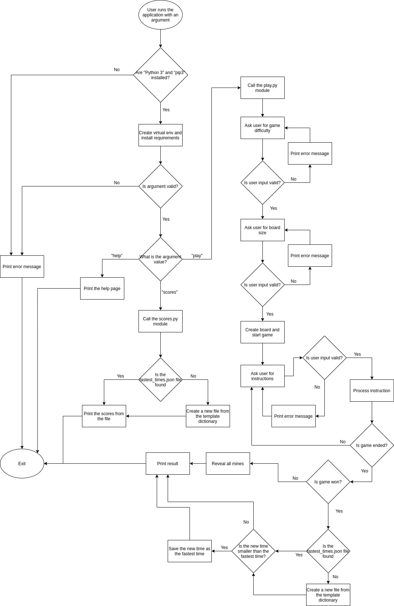

# Statement of Purpose and Scope
This application is a minesweeper game that users can launch and play in the terminal.
The game will allow the user to choose cells from the board. If the user chooses a cell that contains a mine, the user loses the game. If the user chooses a cell that has no bomb, the application will open the cell with a number inside it indicating how many bombs are around it. If there are no bombs around the chosen cell, the application will automatically open all cells immediately surrounding the chosen cell.
Any person will be able to run the application with the help of the provided instructions.

 

# Features
The application will have the following features:
- Option to select game difficulty:
    * This will be chosen by the user at the beginning of the game, after the app launches.
    * Beginner has 10 mines.
    * Intermediate has 40 mines.
    * Expert has 99 mines.
- Option to select board size:
    * This will be chosen by the user at the beginning of the game, after the app launches.
    * For beginner mode, the board size is either 8 × 8, 9 × 9, or 10 × 10.
    * For intermediate mode, the board size is either 13 × 15 or 16 × 16.
    * For expert mode, the board size is always 16 × 30.
- Option to flag or unflag cells:
    * This feature will be directly available during the gameplay by passing a certain instruction.
    * A flagged cell would indicate to the user that the cell contains a mine.
    * This will make it easier for users to ignore cells they aleady analysed.
- Option to show fastest times or scores:
    * This feature will be chosen by the user as an argument when calling the main bash script.
    * These scores will be based on fastest time per game size and difficulty.
    * The scores will be written to, or read from, a separate file.

 

# User Interaction and Experience
- The user can read the help file provided to undersatand how to start using the application and what are the possible arguments.
- The user can also call the main bash script with the "help" argument which will return a list of all possible arguments and their descriptions.
- The application should not break if a user passes wrong, or no, arguments to the bash script and instead should return an error message saying that the argument provided is not supported and print "Run the script with the 'help' argument for a list of possible arguments".
- When the user runs the script with "scores" argument, the application will print the current fastest times to the terminal.
- When the user runs the script with the "play" argument, the game is launched and the user can choose the difficulty and board size. If the user enters a wrong choice for difficulty or size, the application will print an error message and ask the user to choose again. After that, the user is shown a list of instructions explaining how to play the game. If the user enters wrong instructions, the application will print an error message and ask the user to pass an instruction again.

 

# Control Flow Diagram

 
